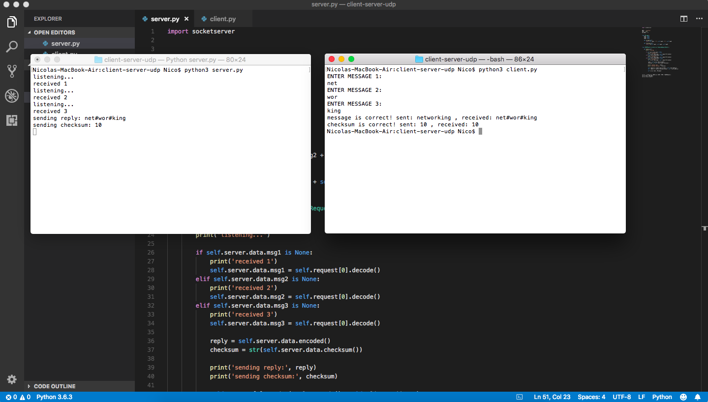
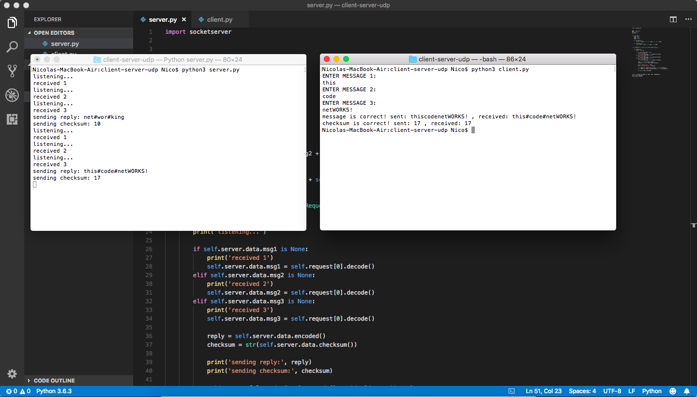

# python-udp-server

Simple implementation of a UDP server and client in pithon.
Written for an assignment to a Computer Networking class.

## the server

The server.py is a program that acts as a UDP server. It listens to port 5454 on the localhost until he receives a total of 3 UDP packets.
Those packets are assumed to contain short strings.
Once the three packets are received, one reply packet is sent back to the client containing the concatenation of the 3 messages previously received,
with an hash symbol (#) between them.
A second reply packet is sent containing the sum of the length of the three packets previously received.
At the end the server clear the received messages and restart the process.

### The client

The client.py is a program that acts as a UDP client.
It creates a UDP socket, and send a total of 3 packets (containing string entered by the user) to the server (localhost) on port 5454.
Once the messages are sent it awaits for a reply packet that is assumed contains a message with the concatenation of the 3 previously sent messages,
separated by an hash symbol (#).

After receiving the first packet it awaits for a second packet which is assumed contains the checksum of previously sent messages.
Once the second packet is received the client check wether the received message is equal to the concatenation of the sent messages.
It also check wether the checksum received is the same as the checksum calculated and displays another message with the answer.

